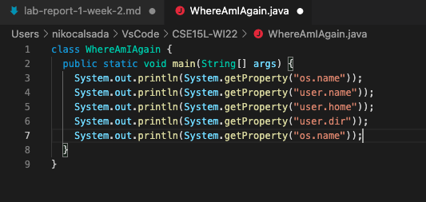

# Week 2: Lab Report 1

## Tutorial - Getting Started with VSCode and Github

---
**Step 1 - Download and Install VSCode**

**Step 2 - Remotely Connecting**

**Step 3 - Trying Terminal Commands**

**Step 4 - Moving Files with scp**

**Step 5 - Setting an SSH Key**

**Step 4 - Optimizing Remote Running**

