# Week 2: Lab Report 1

## Getting Started with VSCode and Github 

---
**Step 1 - Download and Install VSCode**

1. Download VSCode from the following site [https://code.visualstudio.com/]( https://code.visualstudio.com/). Make sure to download the appropriate version for your given operating system. 

2. Install the application and open it to find an empty window.

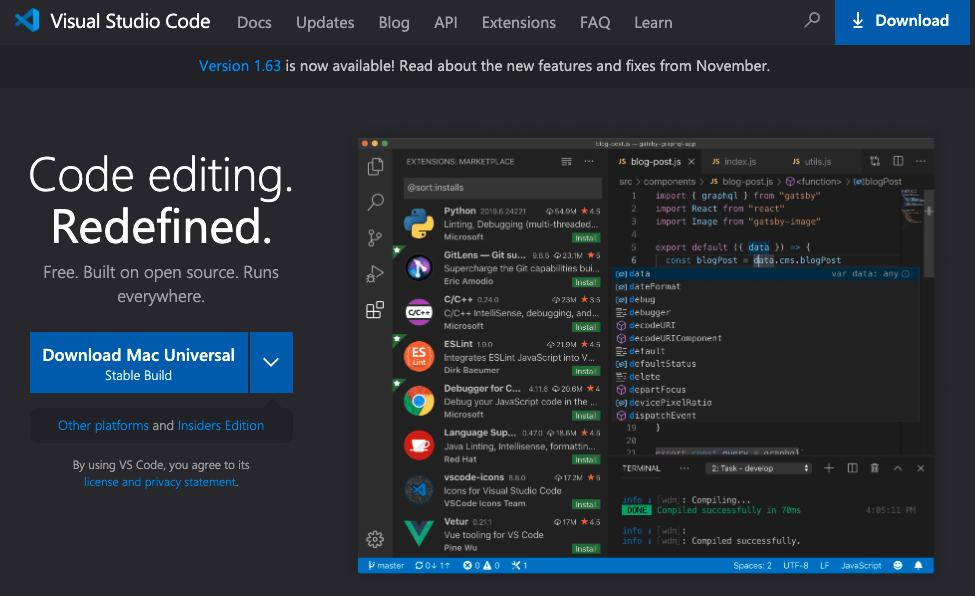


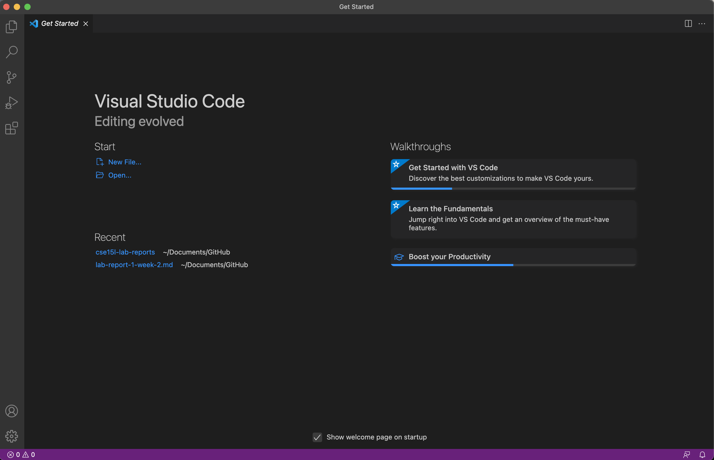


**Step 2 - Remotely Connecting**

1.  UCSD has a host server that students are allowed to access remotely. To access the course-specific account you need to find your assigned email from this [index](https://sdacs.ucsd.edu/~icc/index.php). It may require you to reset your password.

2. In your VSCode terminal, call the following command with your newly given email. 
``` 
ssh cs15lwi22aej@ieng6.ucsd.edu 
```
3. You will then be prompted to provide your password. 
    

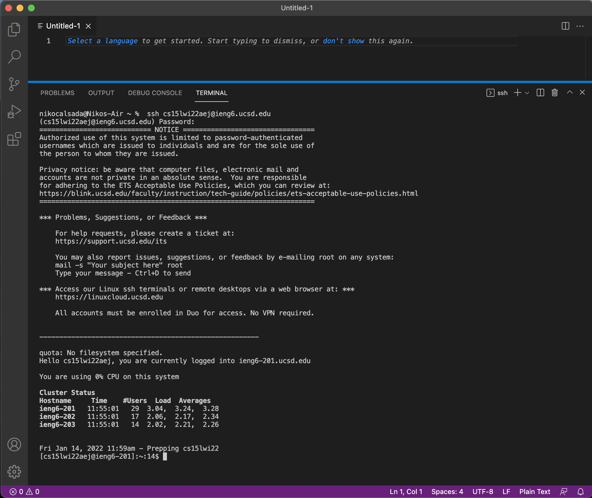

**Step 3 - Trying Terminal Commands**

1. Now that you are connected to the remote server, this is a good opportunity to play around with some common terminal commands.

 ```
 cd
 ls
 ls -a
 pwd
 ```

2. If terminal language is new to you, you are bound to make mistakes but do not get discouraged. This is where the most learning is going to come. Below, you can see the attempts I made at trying out some commands.

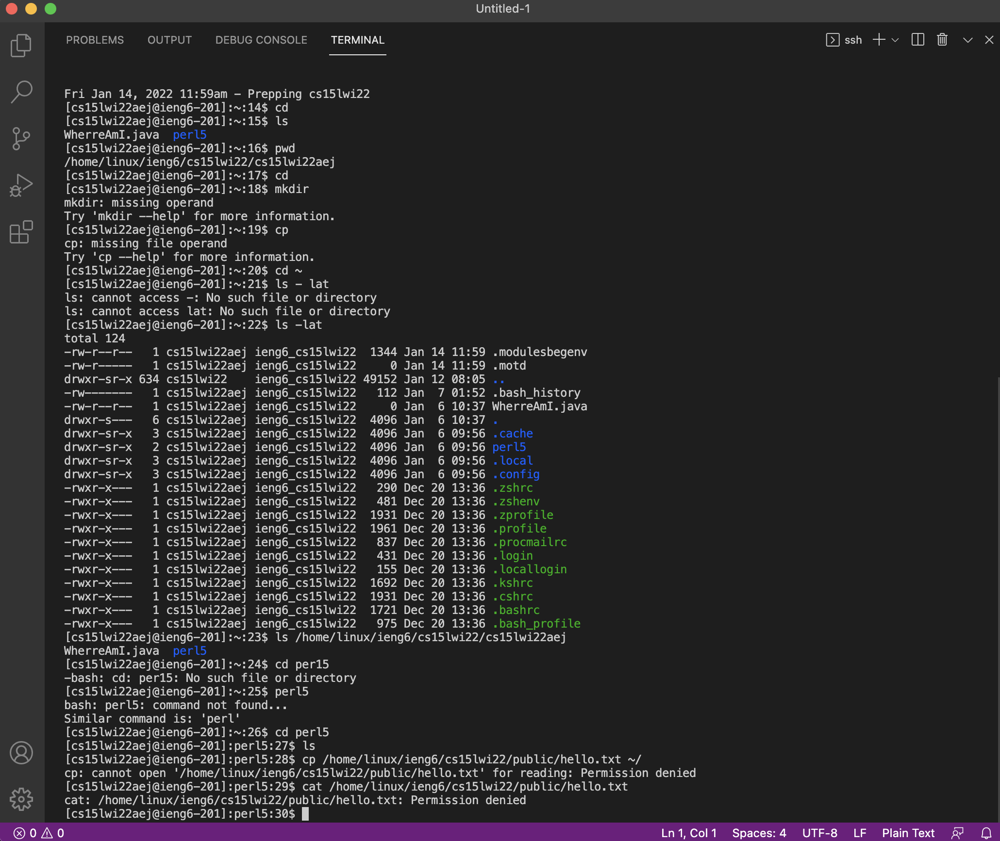


**Step 4 - Moving Files with scp**

1. To logout of the remote server use this command
```
exit
```

2. In your local computer, create a file called WhereAmIAgain.java and add this code

```
class WhereAmIAgain {
  public static void main(String[] args) {
    System.out.println(System.getProperty("os.name"));
    System.out.println(System.getProperty("user.name"));
    System.out.println(System.getProperty("user.home"));
    System.out.println(System.getProperty("user.dir"));
    System.out.println("arbitrary text"); //Added code from WhereAmI 
  }
}
```
3. Now, we will attempt to move that local file onto the remote server. Type this command from the correct directory.
```
scp WhereAmI.java cs15lwi22aej@ieng6.ucsd.edu:~/
```
4. You'll then be prompted to input your password again. If it successfully copied onto the server, your terminal should print out the following

5. You may remotely run and compile the file using this command
```
cp WhereAmIAgain.java OtherMain.java; javac OtherMain.java; java WhereAmIAgain
```

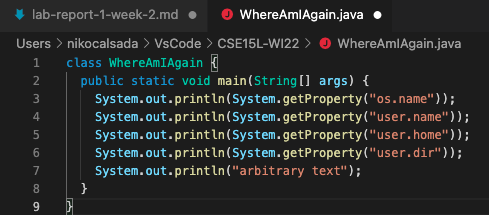


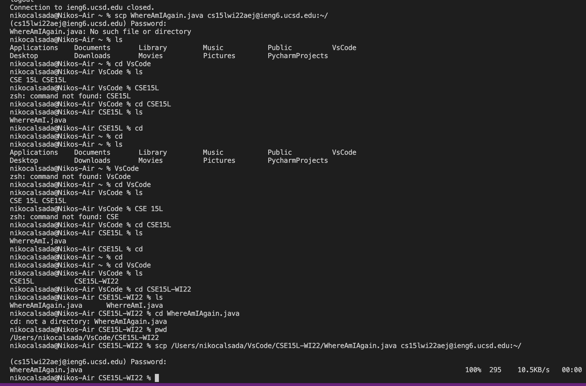


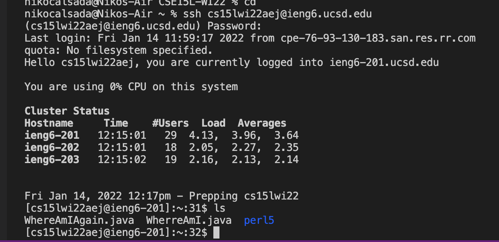


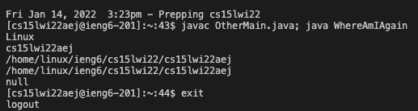


**Step 5 - Setting an SSH Key**

1. To  avoid having to enter your password each time you move files or access the server, we will set up an SSH key. 

- On your local directory type the following command
```
ssh-keygen
```
- Then it will ask for the file in which to save the key. 
```
(/Users/<your own>/.ssh/id_rsa): /Users/<your own>/.ssh/id_rsa
```
- Final, press enter and the confirmation of your ssh key will appear


2. In order to test the key, log into the remote server and you will notice that you are directly granted access.

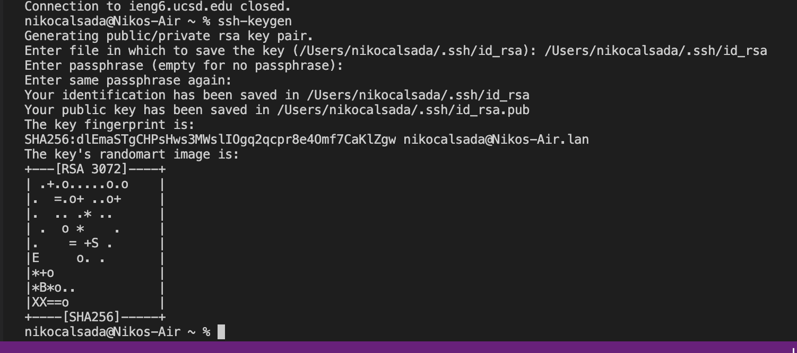


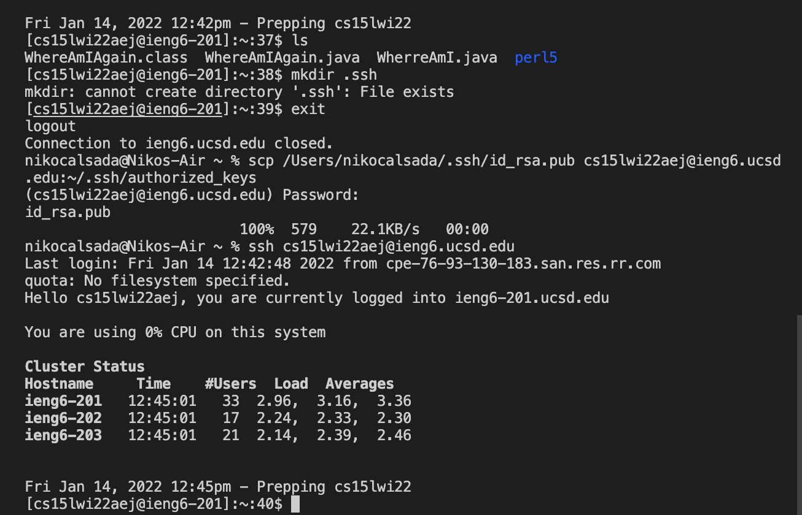


**Step 6 - Optimizing Remote Running**
1. Make a slight change to your local WhereAmIAgain.java file. Here is a quick example 
```
class WhereAmIAgain {
  public static void main(String[] args) {
    System.out.println(System.getProperty("os.name"));
    System.out.println(System.getProperty("user.name"));
    System.out.println(System.getProperty("user.home"));
    System.out.println(System.getProperty("user.dir"));
    System.out.println(System.getProperty("os.name")); /*Printing the first line again at the bottom*/
  }
}
```
2. Now, move the file with scp and notice that the process is a lot faster given your new ssh key.

3. Confirm the changes by running your code again. I suggest using your up key arrow to find the previous code for running and compiling the older version. This function will save you a lot of time moving forward. 

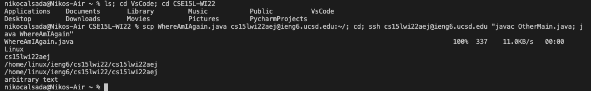

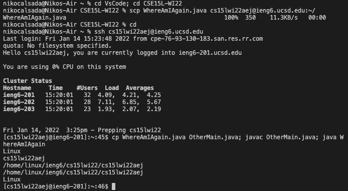

