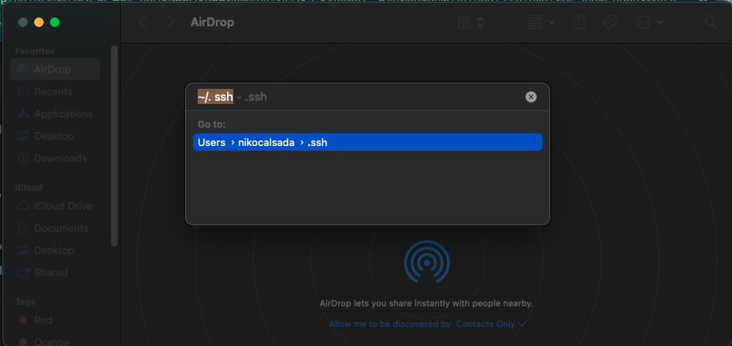
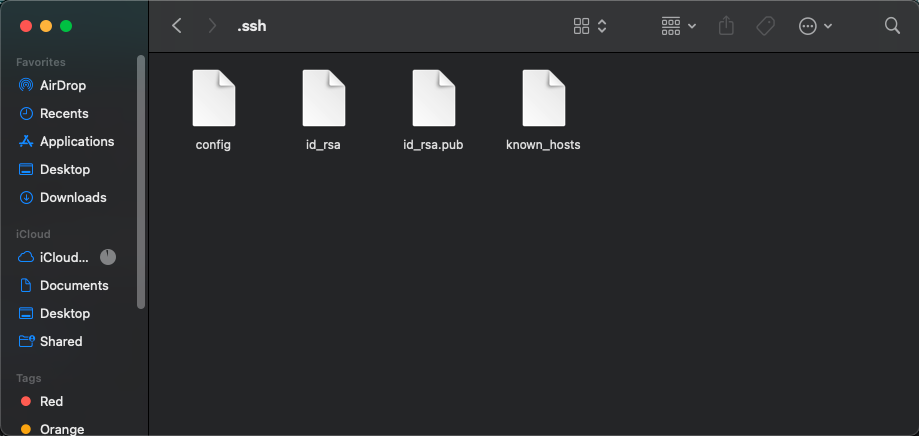
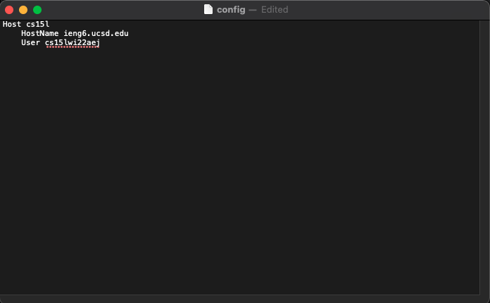
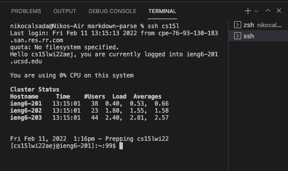
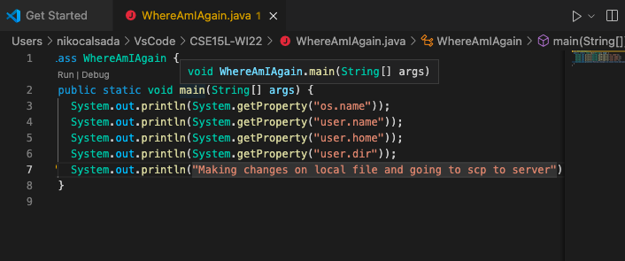
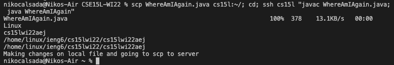

# Week 6: Lab Report 3
 
## Steamlinging ssh Configuration

---
**Step 1 - Setting up config file**

1. To see your . ssh folder in the Finder, press Command+Shift+G, then enter ~/. ssh 



2. Create a config file and add the following code: 
    ``` 
    Host cs15l
    HostName ieng6.ucsd.edu
    User cs15lwi22aej (use your username) 
    ```
    
    

**Step 2 - ssh login and scp**

1. Use the following code to quickly login to the server:
    ```
    ssh cs15l
    ```
    

2. Make a change to our WhereAmIAgain.java file
    

3. We can now use our new alias to speed run the scp and ssh process. Input the following code to copy and run files on the remote server: 
    ```
    scp WhereAmIAgain.java cs15l:~/; cd; ssh cs15l "javac WhereAmIAgain.java; java WhereAmIAgain"
    ```
    