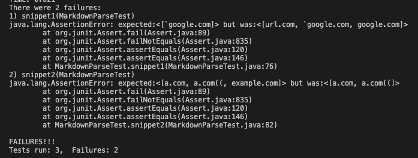
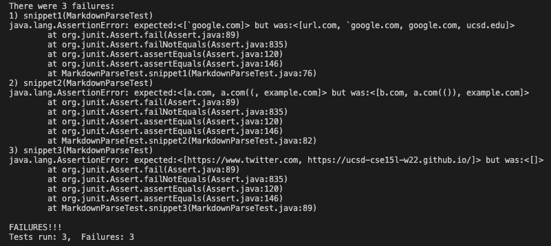

# Week 8: Lab Report 4
 
## Markdown Snippets

---
**My Repositories:**

1. [My Repository](https://github.com/kneeko97/markdown-parse.git)
2. First, lets look at my implementation for adding snippet tests. 
    ```
    @Test 
    public void snippet1() throws IOException{
        String contents = Files.readString(Path.of("./snippet1.md"));
        List<String> expect = List.of("`google.com");
        assertEquals(expect, MarkdownParse.getLinks(contents));
    }

    @Test
    public void snippet2() throws IOException{
        String contents = Files.readString(Path.of("./snippet2.md"));
        List<String> expect = List.of("a.com", "a.com((", "example.com");
        assertEquals(expect, MarkdownParse.getLinks(contents));
    }

    @Test
    public void snippet3() throws IOException{
        String contents = Files.readString(Path.of("./snippet3.md"));
        List<String> expect = List.of("https://www.twitter.com", "https://ucsd-cse15l-w22.github.io/");
        assertEquals(expect, MarkdownParse.getLinks(contents));
    }
    ```
3. My snippet3 test passed but the first two failed. Lets take a look at the test failure output.
    

**Other Group Repository**
1. [Their repository link](https://github.com/atruong39/markdown-parse.git)

2. I used the same implementation for the other groups MarkdownParseTest.java file
    ```
    @Test 
    public void snippet1() throws IOException{
        String contents = Files.readString(Path.of("./snippet1.md"));
        List<String> expect = List.of("`google.com");
        assertEquals(expect, MarkdownParse.getLinks(contents));
    }

    @Test
    public void snippet2() throws IOException{
        String contents = Files.readString(Path.of("./snippet2.md"));
        List<String> expect = List.of("a.com", "a.com((", "example.com");
        assertEquals(expect, MarkdownParse.getLinks(contents));
    }

    @Test
    public void snippet3() throws IOException{
        String contents = Files.readString(Path.of("./snippet3.md"));
        List<String> expect = List.of("https://www.twitter.com", "https://ucsd-cse15l-w22.github.io/");
        assertEquals(expect, MarkdownParse.getLinks(contents));
    }
    ```
3. None of their tests passed. Lets take a look at the test failure output.
    
