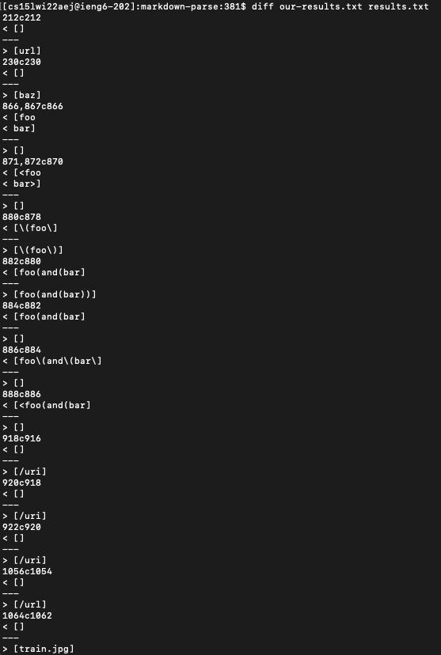
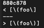
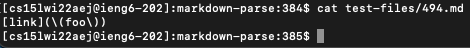
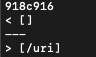
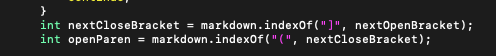

# Week 10: Lab Report 5
 
## Comparing Two Implementations

---
**How I Found the Differences**
1. First, I used the following code:
    ```
    diff our-results.txt results.txt
    ```
    This  function was very useful because it extracted only the results that differed between mine and Joe's
    implementations. The picture below contains most of the differing results.
    
2. Then, I went into results.txt and in order to see the line numbers I used the following commands:
    ```
    vim our-results.txt
    :set nu
    ```
    This allowed me to find which particular test file in test-files that caused the different results.


**First Difference:**






1. Based on the contents of test file 494, it appears that Joe's implementation was correct. My code did not register that the backslash before the first instance of the openParen meant that it was to be read as a character rather than link syntax.

2. I would have to implement a checker that searches for a backslash before all of my open/close brackets and paretheses.

**Second Difference:**

]


1. It appears that my implemenation was correct because proper link syntax should not allow for a space between the nextCloseBracket and openParen.

2. To fix this, Joe should implement a checker to ensure that openParen is only one index away from nextCloseBracket. This could be added to his code after he finds openParen.
    